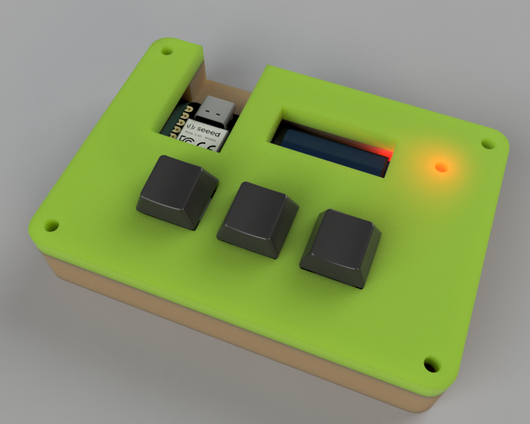
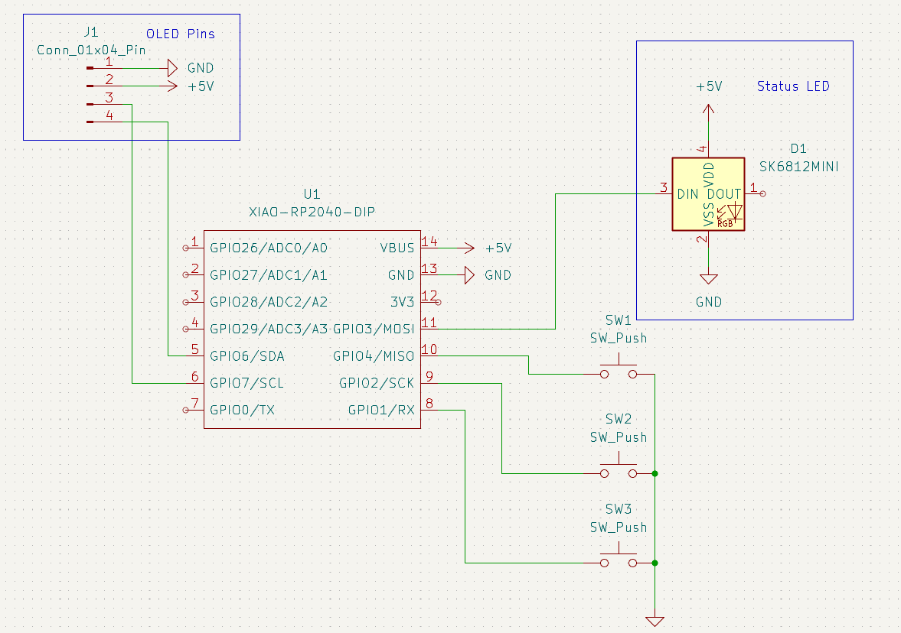
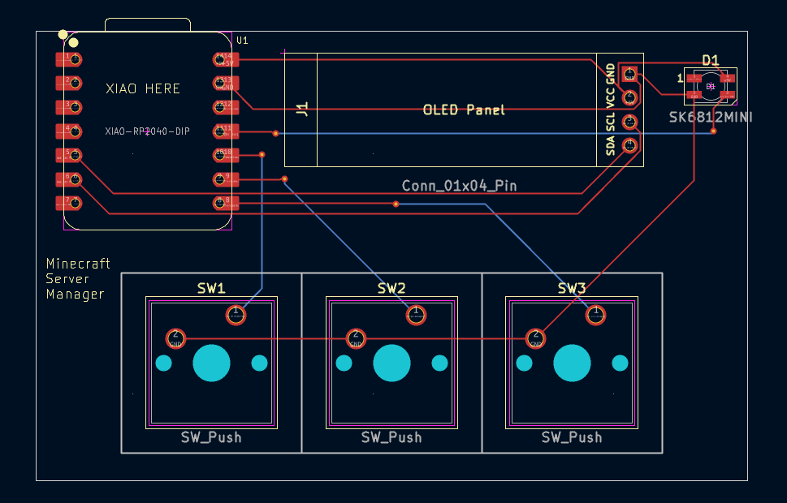
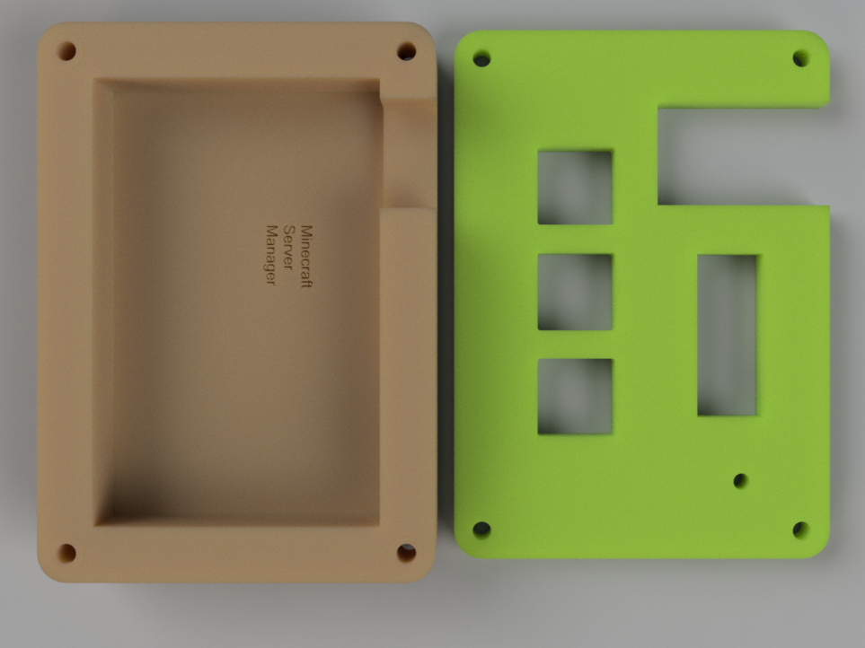

# Minecraft Server Manager Hackpad
A hackpad designed to control a Minecraft server. It has a key to start the server, a status LED to indicate the server state, a screen to display the live chat, and two keys to navigate between different modes.

## Why did I make it?
I have a Minecraft server with my friends and often don't notice it when my friends are online, so I wanted to make this device to show when my friends go online. 

Couldn't I just make a Discord bot to ping me when my friends go online? Yeah, but it wouldn't be as fun as making a special device for on my desk and shows the Minecraft chat live.

## How does it work?
The main logic of checking the server status and the chat isn't done on the Hackpad itself, but instead on the computer it is connected to. To make this work the pc will need to run the ```host.py```. This is going to connect with Home Assistant and will gather and process all the information.

The program can send the following to the Hackpad (over USB):
- LED:{color}
- CHAT:{person}-{message}
- PLAYERS:{amount}
- MODE:{mode}

The Hackpad will only send its button presses:
- START
- MODE_NEXT
- MODE_PREV



## Hardware
Schematic            |  PCB         |   Case
:-------------------------:|:-------------------------:|:-------------------------:|
    |    | 

## BOM:
- 3x Cherry MX Switches
- 3x DSA Keycaps
- 1x SK6812 MINI-E LED
- 1x 0.91" 128x32 OLED Display
- 1x XIAO RP2040
- 1x Case (2 printed parts)